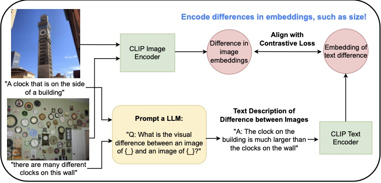

# PC-CLIP

Our GitHub repository for the paper "Finetuning CLIP to Reason about Pairwise Differences", and the full paper can be found [here](https://www.arxiv.org/abs/2409.09721).



## Setup

To setup an environment to run our code, please run the following command in a new conda enviroment (with Python 3.8).

``` 
pip install -r requirements.txt
```

## Data

We perform finetuning on MS COCO, and since we only update our text encoder, we have precomputed the image embeddings for each instance. These embeddings can be found [here](https://drive.google.com/file/d/1dRap0Ses7SajnGoj8hczvJ_o2Ze6JztX/view?usp=sharing). This file should be downloaded and placed in a directory called "pc_clip/data". 

We also provide our synthetically generated, natural langauge differences generated by LLaMA2 13B, which can be found [here](https://drive.google.com/file/d/1yYzHizjCy9ewfagL4uG-iZHQXsWLz48p/view?usp=sharing). This file should be placed in a directory called "pc_clip/llm_diffs". 

Both of these files should be downloaded if you want to perform finetuning.

## Model

Our model checkpoint can downloaded [here](https://drive.google.com/file/d/1OZGQ8f6N4WuSQFn4-e7kzcEZdpKPbEfp/view?usp=sharing). This contains a version of PC-CLIP that has been finetuned
with our synthetically generated comparatives dataset.

Alternatively, you can perform finetuning yourself by running the following command:

``` 
python finetune.py
```

## Evaluation

After downloading our model checkpoint (or performing your own finetuning process), you can evaluate the trained models by running the following:

``` 
python run.py --dataset cifar100 --checkpoint <path_to_ckpt>
```

## Contact

If you have used this repository or found our paper useful, please consider citing our work:

```bibtex
@article{sam2024finetuning,
  title={Finetuning CLIP to Reason about Pairwise Differences},
  author={Sam, Dylan and Willmott, Devin and Semedo, Joao D and Kolter, J Zico},
  journal={arXiv preprint arXiv:2409.09721},
  year={2024}
}
```

Otherwise, you can reach out to dylansam@andrew.cmu.edu if you have any questions!
